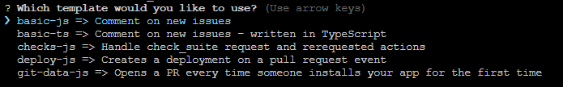

## Private Keys

-   ETH Private Key ✅
-   ETH Public Key ✅
-   PGP Private Key Block ✅
-   PGP Public Key Block ✅

## Implementations

-   Implementation: l_impl/python/main.py ✅
-   Implementation: l_impl/rust/main.rs 🧑🏼‍🏭

## Steps

1.  Make checks
2.  run the implementation in main.py or main.rs
3.  if the implementation findes any key, fail the check
4.  then add label to the PR, `pk` + add comment with @ of the user who made the PR
5.  if the implementation findes no key, pass the check
6.  then remove label to the PR, `pk` and change to `secure`

